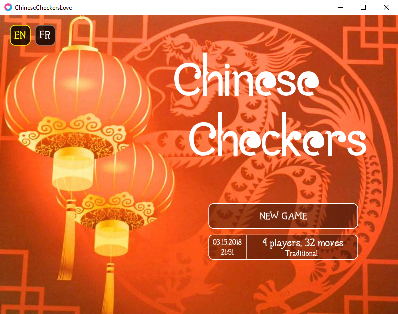
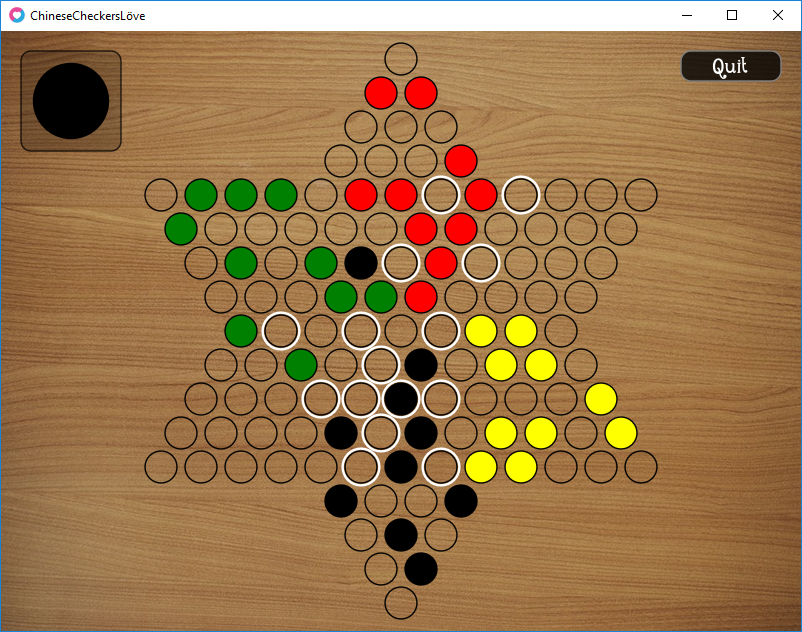
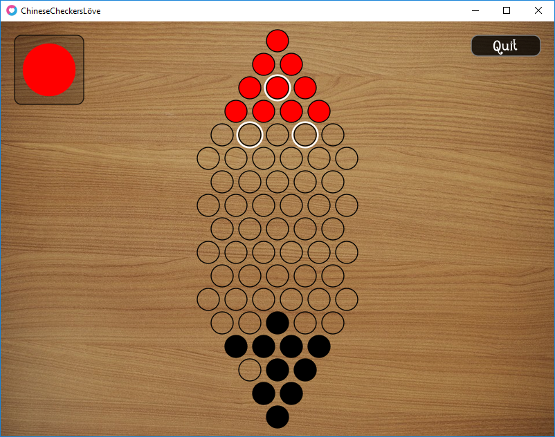

# ChineseCheckersLove

Chinese Checkers game in [LÖVE](https://love2d.org/)

## How to run

* Clone this repository:
```
git clone https://github.com/carlito767/ChineseCheckersLove.git
```
* Install [LÖVE](https://love2d.org/) (minimum version: 0.10.2) and add it to PATH
* Launch LÖVE in game folder, via command prompt:
```
love .
```

## Third-party libraries

* [Data Dumper](http://lua-users.org/wiki/DataDumper)

## Credits

* [Batik Gangster](http://www.fontspace.com/gunarta/batik-gangster) by [Gunarta](http://www.fontspace.com/gunarta) is [Freeware](https://en.wikipedia.org/wiki/Freeware)
* [Maharani](http://www.fontspace.com/gunarta/maharani) by [Gunarta](http://www.fontspace.com/gunarta) is licensed under [SIL Open Font License (OFL)](https://en.wikipedia.org/wiki/SIL_Open_Font_License)
* [Chinese New Year Greeting Card Design with Lantern and Dragon Picture](http://allpicts.in/chinese-new-year-card-design-with-lantern-and-dragon-picture/) by [Allpicts.in](http://allpicts.in/) is free

## Screenshots



